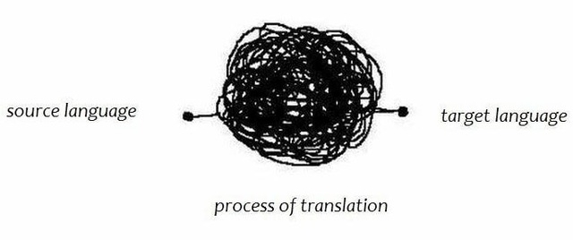

<h1 align="center" style="text-align: center;">Polyglot - Automate translations with DeepL</h1>

<div align="center" style="text-align: center;">


</div>

Polyglot is a CLI tool that automates translation tasks and can be easily integrated into your python softwares.
Using the [**DeepL API**](https://www.deepl.com/it/docs-api/), Polyglot generates a translated file from a given source file.

<div align="center" style="text-align: center;">
    
</div>

## Supported files

Polyglot is born to translate **JSON** and **PO** files, but now it supports other files. This is the complete list:

- json
- po and pot
- docx (Microsoft **Word**)
- pptx (Microsoft **PowerPoint**)
- html and htm
- pdf
- raw text files like .txt or .dat

> ⚠️ If you want to translate **PDF**s, rember to enable the PDF translations from your DeepL API account.

## Installation

Install [Python](https://www.python.org/) if you haven't already done so, then use **pip** to install Polyglot.

```shell
pip install polyglot-translator
```

Then you can run Polyglot by running:

```shell
python -m polyglot
```

And that's all.

Soon the whole script will be packaged for other package managers like pacman, apt and brew.

## Usage

There are four available commands: translate, set_license, print_usage_data and print_supported_languages.

### Translate

"Translate" is the main feature of Polyglot. It reads the passed file and creates one or more new files with the translations. It creates a new file with the translations and doesn't edit the source file.

> ℹ️ In the case of a PO and POT files, it returns both a PO and an MO file.

#### Command options

| Option                | Required | Description                                                                                                                                        |
| :-------------------- | :------- | :------------------------------------------------------------------------------------------------------------------------------------------------- |
| -s, --source-file     | yes      | The file to be translated.                                                                                                                         |
| --to, --target-lang   | yes      | the code of the language into which you want to translate the source file                                                                          |
| -d, --destination-dir | no       | The directory where the output file will be located. **Will be used the working directory if this option is invalid or not used**.                 |
| --from, --source-lang | no       | Source file language code. Detected automatically by DeepL by default. Specifying it can increase performance and make translations more accurate. |

#### Basic usage

E.g.: we have a .json source in English and we want to translate it in Italian.

```shell
python -m polyglot translate -s en.json --to IT
```

#### Advanced usage

E.g.: we have a .po source in English and we want a .po file translated into Japanese with the corresponding .mo file in our home. We specify the source language to benefit DeepL.

```shell
python -m polyglot translate -s en.po --to JA -d $HOME --from EN-US
```

### Set DeepL API key

**DeepL provides you with a key that allows you to use its API**. So, Polyglot requires this key to work and will ask you for it on your first use. You can use the following command to set or change the key manually.

```shell
python -m polyglot set-license
```

### Print usage info

It returns DeepL usage info related to your API key, run with:

```shell
python -m polyglot info
```

### Print supported languages

It returns the list of languages currently supported by DeepL, run with:

```shell
python -m polyglot languages
```

## Dependencies

- [DeepL Python](https://github.com/DeepLcom/deepl-python)
- [Colorama](https://github.com/tartley/colorama)
- [Progressbar 2](https://github.com/WoLpH/python-progressbar)
- [Polib](https://github.com/izimobil/polib/)
